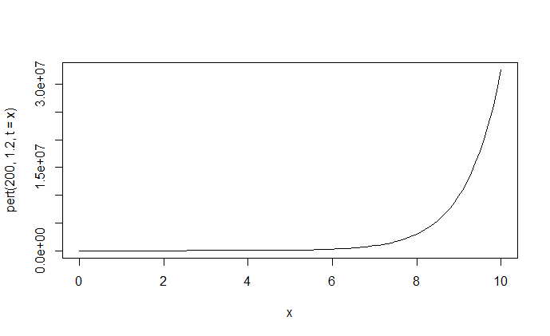

# Functions of Functions and the Exponential Function

## Exponential Growth and Decline

Exponential growth is typically expressed as:

$y(t)=Ae^{kt}$

Figure: Exponential growth curve

### Details

:::note Definition

**Exponential growth** is the rate of population increase across time when a population is devoid of limiting factors (i.e. competition, resources, etc.) and experiences a constant growth rate.

:::

Exponential growth is typically expressed as:

$y(t)=Ae^{kt}$

where\ $A$ (sometimes denoted $P$ )=initial population size\ $k$ = growth rate\ $t$ =number of time intervals

:::note Note

*Note 10*.
Note that exponential growth occurs when $k>0$ and exponential decline occurs when $k<0$.

:::

## The Exponential Function

An exponential function is a function with the form: $f(x)=b^x$

### Details

For the exponential function $f(x)=b^x$, $x$ is a positive integer and $b$ is a fixed positive real number.
The equation can be rewritten as:

$$f(x)=b^x=b\cdot b \cdot b \cdot \dots \cdot b.$$

When the exponential function is written as $f(x)=e^x$ then, it has a growth rate at time $x$ equivalent to the value of $e^x$ for the function at $x$.

## Properties of the Exponential Function

Recall that the methods of the basic arithmetic implies that:

$$e^{a+b} = e^a e^b$$

for any real numbers $a$ and $b$.

## Functions of Functions

### Details

Consider two functions, $f$ and $g$, each defined for some set of real numbers.
Where $x$ can be solved in function $f$ using $Y = f(x)$ when $g(Y)$ exists for all such resulting $y$.
If $y = f(x)$ and $g(y)$ exist then we can compute $g(f(x))$ for any $x$.

If $f(x) = {x}^2$ and $g(y)= {e}^y$, then

$$g(f(x))= {e}^{f(x)} = {e}^{x^2}.$$

If we call the resulting function $h$, then $h(x) = g(f(x))$.
Another common notation for this is

$$h = g\circ f.$$

### Examples

:::info Example

If $g(x)= {3}+ {2}x$ and $f(x) = {5}{x}^2$, then

$$g(f(x)) = {3} +{2} f(x) = {3} +{10x}^2,$$

and

$$f(g(x)) = {5}{(g(x))}^2 = {5}{({3}+{2x})}^2 = {45}+{60x}+{20x}^2.$$

:::

## Storing and Using R Code

As R code gets more complex (more lines) it is usually stored in files.
Functions are typically stored in separate files.

### Examples

:::info Example

Save the following file ( $\verb|test.r|$ ):

x=4 y=8 cat("x+y is", x+y, "\n")

To read the file use:

source("test.r")

and the outcome of the equation is displayed in R

:::

## Storing and Calling Functions In R

To save a function in a separate file use a command of the form $\verb|function.r|$.

### Examples

:::info Example

f<-function(x) { return (exp(sum(x))) }

can be stored in a file function.r and subsequently read using the source command.

:::
