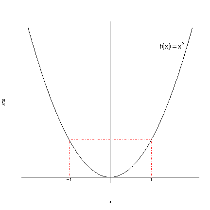

# Inverse Functions and the Logarithm

## Inverse Function

If $f$ is a function, then the function $g$ is the inverse function of $f$ if

$$g(f(x))=x$$

for all $x$ in which $f(x)$ can be calculated

### Details

The inverse of a function $f$ is denoted by $f^{-1}$, i.e.

$$f^{-1}(f(x))=x$$

### Examples

:::info Example

If $f(x) = x^2$ for $x<0$ then the function $g$, defined as $g(y)=\sqrt{y}$ for $y>0$, is not the inverse of $f$ since $g(f(x))=\sqrt{x^2}= |x|= -x$ for $x<0$.

:::

## When the Inverse Exists: The Domain Question

Inverses do not always exist.
For an inverse of $f$ to exist, $f$ must be one-to-one, i.e. for each $x$, $f(x)$ must be unique.

Figure: The function $f(x)=x^2$ does not have an inverse since $f(x)=1$

has two possible solutions $-1$ and $1$.

### Examples

:::info Example

$f(x)=x^2$ does not have an inverse since $f(x)=1$ has two possible solutions -1 and 1.

:::

:::note Note

*Note 11*.
Note that iff $f$ is a function, then the function $g$ is the inverse function of $f$, if $g(f(x)) = x$ for all calculated values of $x$ in $f(x)$ 

The inverse function of $f$ is denoted by $f^{-1}$, i.e. $f^{-1}(f(x)) = x$.

:::

:::info Example

What is the inverse function, $f^{-1}$, of $f$ if $f(x) = 5 + 4x$ 

The simplest approach is to write $y=f(x)$ and solve for $x$ :

With

$$f(x) = 5 + 4x$$

we write

$$y = 5 + 4x$$

which we can now rewrite as

$$y - 5 = 4x$$

and this implies

$$\frac{y-5}{4} = x$$

And there we have it, very simple:

$$f^{-1}(f(x)) = \frac{y - 5}{4}$$

:::

## The Base 10 Logarithm

When $x$ is a positive real number in $x=10^y$, $y$ is referred to as the base 10 logarithm of x and is written as:

$$y=\log_{10}(x)$$

or

$$y=\log(x)$$

### Details

If $\log (x) = a$ and $\log (y)=b$, then $x = 10^a$ and $y = 10^b$, and

$$x \cdot y = 10^a \cdot 10^b = 10^{a+b}$$

so that

$$\log(xy) = a+b$$

### Examples

:::info Example

$$\begin{aligned} \log(100)&=& 2 \\ \log(1000)&=& 3\end{aligned}$$

:::

:::info Example

If

$$\log(2) \approx 0.3$$

then

$$10^y=2$$

> **Note**: > > *Note 12*.
> Note that > > $$2^{10}=1024 \approx 1000 = 10^3$$ > > therefore > > $$2 \approx 10^{3/10}$$ > > so > > $$\log (2) \approx 0.3$$ >

:::

## The Natural Logarithm

A logarithm with $e$ as a base is referred to as the natural logarithm and is denoted as $\ln$ :

$$y=\ln(x)$$

if

$$x=e^y=\exp(y)$$

Note that $\ln$ is the inverse of $\exp$.

Figure: The curve depicts the fuction $y=\ln(x)$ and shows that $\ln$ is the inverse of $\exp$.
Note that $\ln(1)=0$ and when $y=0$ then $e^0=1$.

## Properties of Logarithm(s)

Logarithms transform multiplicative models into additive models, i.e.

$$\ln(a\cdot b) = \ln a + \ln b$$

### Details

This implies that any statistical model, which is multiplicative becomes additive on a log scale, e.g.

$$y = a \cdot w^b \cdot x^c$$

$$\ln y = (\ln a) + \ln (w^b) + \ln (x^c)$$

Next, note that

$$\begin{aligned} \ln (x^2)&=& \ln (x \cdot x)\\ &=& \ln x + \ln x\\ &=& 2 \cdot \ln x\end{aligned}$$

and similarly $\ln (x^n) = n \cdot \ln x$ for any integer $n$.

In general $\ln (x^c) = c \cdot \ln x$ for any real number c (for $x>0$ ).

Thus the multiplicative model (from above)

$$y=a \cdot w^b \cdot x^c$$

becomes

$$y= (\ln a) + b \cdot \ln w + c \cdot \ln x$$

which is a linear model with parameters $(\ln a)$, $b$ and $c$.

In addition, the log-transform is often variance-stabilizing.

## The Exponential Function and the Logarithm

The exponential function and the logarithms are inverses of each other

$$x = e^y \Leftrightarrow y = \ln{x}$$

### Details

:::note Note

*Note 13*.
Note the properties:

$$\ln (x \cdot y) = \ln (x) + \ln (y)$$

and

$$e^a \cdot e^b = e^{a+b}$$

:::

### Examples

:::info Example

Solve the equation

$$10e^{1/3x} + 3 = 24$$

for $x$.

First, get the $3$ out of the way.

$$10e^{1/3x} = 21$$

Then the $10$.

$$e^{1/3x} = 2.1$$

Next, we can take the natural log of 2.1.
Since $\ln$ is an inverse function of $e$ this would result in

$$\frac{1}{3}x = \ln(2.1)$$

This yields

$$x = \ln(2.1) \cdot 3$$

which is

$$\approx 2.23$$

:::
