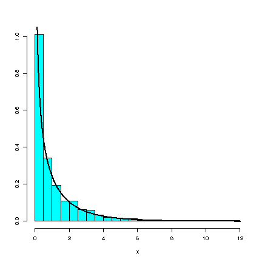

# Some Distributions Related to the Normal

## The Normal and Sums of Normals

The sum of independent normally distributed random variables is also normally distributed.

### Details

The sum of independent normally distributed random variables is also normally distributed.
More specifically, if $X_1 \sim N(\mu_1, \sigma_{1}^2)$ and $X_2 \sim N(\mu_2, \sigma_{2}^2)$

are independent then $X_1 + X_2 \sim N(\mu, \sigma^2)$ since $\mu = E \left[ X_1 + X_2 \right] = \mu_1 + \mu_2$ and\ $\sigma^2 = Var \left[ X_1 + X_2 \right]$ with $\sigma^2 = \sigma_{1}^2 + \sigma_{2}^2$ \ if $X_1$ and $X_2$ are independent

Similarly

$$\sum_{i=1}^{n} X_i$$

is normal if $X_1, \ldots, X_n$ are normal and independent.

### Examples

:::info Example

Simulating and plotting a single normal distribution. $Y \sim N(0,1)$

library(MASS) # for truehist par(mfcol=c(2,2)) y<-rnorm(1000) # generating 1000 N(0,1) mn<-mean(y) vr<-var(y) truehist(y,ymax=0.5) # plot the histogram xvec<-seq(-4,4,0.01) # generate the x-axis yvec<-dnorm(xvec) # theoretical N(0,1) density lines(xvec,yvec,lwd=2,col="red") ttl<-paste("Simulation and theory N(0,1)\n", "mean=",round(mn,2), "and variance=",round(vr,2)) title(ttl)

:::

:::info Example

Sum of two normal distributions.

$$Y_1 \sim N(2, 2^2)$$

and

$$Y_2 \sim N(3, 3^2)$$

y1<-rnorm(10000,2,2) # N(2,2^2) y2<-rnorm(10000,3,3) # N(3, 3^2) y<-y1+y2 truehist(y) xvec<-seq(-10,20,0.01) # check mn<-mean(y) vr<-var(y) cat("The mean is",mn,"\n") cat("The variance is ",vr,"\n") cat("The standard deviation is",sd(y),"\n") yvec<-dnorm(xvec,mean=5,sd=sqrt(13)) # N() density lines(xvec,yvec,lwd=2,col="red") ttl<-paste("The sum of N(2,2^2) and N(3,3^2)\n", "mean=",round(mn,2), "and variance=",round(vr,2)) title(ttl)

:::

:::info Example

Sum of nine normal distributions, all with $\mu = 42$ and $\sigma^2=2^2$

ymat<-matrix(rnorm(10000*9,42,2),ncol=9) y<-apply(ymat,1,mean) truehist(y) # check mn<-mean(y) vr<-var(y) cat("The mean is",mn,"\n") cat("The variance is ",vr,"\n") cat("The standard deviation is",sd(y),"\n") # plot the theoretical curve xvec<-seq(39,45,0.01) yvec<-dnorm(xvec,mean=5,sd=sqrt(13)) # N() density lines(xvec,yvec,lwd=2,col="red") ttl<-paste("The sum of nine N(42^2) \n", "mean=",round(mn,2), "and variance=",round(vr,2)) title(ttl)

:::

## The Chi-square Distribution

If $X \sim N(0,1)$,then $Y = X^2$ has a distribution which is called the chi-square distribution ( $\chi^2$ ) on one degree of freedom.
This can be written as:

$$Y \sim \chi^2$$

### Details

:::note Definition

If $X_1, X_2, \ldots, X_n$ are i.i.d. $N(0,1)$ then the distribution of

$Y = X_1^2 + X_1^2 + \ldots + X_n^2$ has a **square ( $\chi^2$ )distribution**.

:::

## Sum of Chi-square Distributions

Let $Y_1$ and $Y_2$ be independent variables.
If $Y_1 = \chi^2_{\nu_1}$

and $Y_2 = \chi^2_{\nu_2}$, then the sum of these two variables also follows a chi-squared ( $\chi^2$ )distribution

$$Y_1 + Y_2 = \chi^2_{\nu_1+ \nu_2}$$

### Details

:::note Note

*Note 20*.
Recall that if

$$X_1, \ldots, X_n \sim N (\mu, \sigma^2)$$

are i.i.d., then

$$\sum_{i=1}^n \left ( \frac {\bar{X} - \mu} {\sigma}\right ) ^2= \sum_{i=1}^n \frac {\left ( \bar{X} - \mu\right ) ^2} {\sigma}\sim \chi^2$$

:::

## Sum of Squared Deviation

If $X_1,\cdots,X_n \sim N(\mu,\sigma^2)$ i.i.d, then

$$\sum_{i=1}^n \left ( \frac{X_i-\mu}{\sigma} \right )^2 \sim \chi_{n}^2,$$

but we are often interested in

$$\frac{1}{n-1}\sum_{i=1}^n (X_i-\bar{X})^2\sim \chi_{n-1}^2.$$

### Details

Consider a random sample of Gaussian random variables, i.e. $X_1,\cdots,X_n \sim N(\mu,\sigma^2)$ i.i.d.
Such a collection of random variables have properties which can be used in a number of ways.

$$\sum_{i=1}^n \left ( \frac{X_i-\mu}{\sigma} \right )^2 \sim \chi_{n}^2,$$

but we are often interested in

$$\frac{1}{n-1}\sum_{i=1}^n (X_i-\bar{X})^2\sim \chi_{n-1}^2.$$

:::note Note

*Note 21*.
A degree of freedom is lost because of subtracting the estimator of the mean as opposed to the true mean.

:::

The correct notation is:

$\mu$ := population mean

$\bar{X}$ := sample mean (a random variable)

$\bar{x}$ := sample mean (a number)

## The $T$ distribution

If $U\sim N(0,1)$ and $W\sim\chi^{2}_{\nu}$ are independent, then the random variable

$$T=\frac{U}{\sqrt{\frac{w}{\nu}}}$$

has a distribution which we call the $T$ distribution on $\nu$ degrees of freedom denoted $T \sim t_{\nu}$.

### Details

:::note Definition

If $U\sim N(0,1)$ and $W\sim\chi^{2}_{\nu}$ are independent, then the random variable

$$T:=\frac{U}{\sqrt{\frac{w}{\nu}}}$$

has a distribution which we call the $T$ distribution on $\nu$ degrees of freedom, denoted $T \sim t_\nu$.

:::

It turns out that if $X_1, \ldots,X_n \sim N(\mu,\sigma ^2)$ and we set

$$\bar{X}=\frac{1}{n}\sum_{i=1}^n X_i$$

and

$$S= \sqrt{\frac{1}{1-n}\sum_{i=1}^n (X_i-X)^2}$$

then

$$\frac{\bar{X}-\mu}{S/\sqrt{n}} \sim t_{n-1}.$$

This follows from $\bar{X}$ and $\Sigma_{i=1}^N(X_i-\bar{X})^2$ being independent and $\frac{\bar{X}-\mu}{\sigma/\sqrt{n}}\sim N(0,1)$, $\sum \frac{(X_i-\bar{X})^2}{\sigma^2}\sim \chi_{n-1}^2$.
