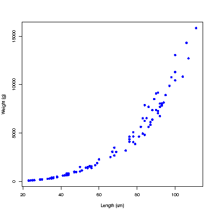

# Simple Data Analysis In R

## Entering Data; Dataframes

Several methods exist to enter data into R:

1. Enter directly $\verb| x<-c(4,3,6,7,8) |$

2. Read in a single vector: $\verb| x<-scan("filename")|$

3. Use: $\verb| x<-read.table("file address")|$

### Details

The most direct method will not work if there are a lot numbers; therefore, the second method is to read in a single vector by x\<-scan(\"filename\"), \"filename\" = text string, either a full path name or refers to a file in the working directory

The scan() command returns a vector, but the read.table() command returns a dataframe, which is a rectangular table of data whose columns have names.
A column can be extracted from a data frame, e.g., with x\<- dat$a where \"dat" is the name of the data frame and \"a\" is the name of a column.

:::note Note

*Note 8*.
Note that for read.table(\"file address\"), \"file address\" refers to the location of the file.
Thus, it can be the URL or the complete file directory depending on where the table is stored.

:::

### Examples

:::info Example

Below are three examples using R code to enter data

1. $\verb|x<-c(4,3,6,7,8) |$

2. $\verb|x<-scan("lecture 70.txt")|$

3. $\verb|x<-read.table("http&#58;&#47;&#47;notendur&period;hi&period;is/~gunnar/kennsla/alsm/data/set115.dat", header=T)|$

:::

## Histograms

A histogram is a graphical display of tabulated frequencies, shown as bars.

In R use the command: $\verb|hist(x)|$

### Examples

A histogram is a graphical display of tabulated frequencies, shown as bars.

## Bar Charts

The bars in a bar chart usually correspond to frequencies in categories and are therefore kept apart.

### Details

A bar chart is similar to the histogram but is used for categorical data.

## Mean, Standard Error, Standard Deviations

### Details

The most familiar measure of central tendency is the arithmetic mean.

:::note Definition

An **arithmetic mean** is the sum of the values divided by the number values, typically expressed as:

$$\bar{y} = \frac{\Sigma_{i=1}^{n} y_i}{n}$$

:::

:::note Definition

The **sample variance** is a measure of the spread of a set of values from the mean value:

$$s^2 = \frac{1}{n-1}\displaystyle\sum_{i=1}^{n}(x_i - \bar{x} )^2$$

:::

The sample standard deviation is more commonly used as a measure of the spread of a set of values from the mean value.

:::note Definition

The **standard deviation** is the square root of the variance and may be expressed as:

$$s = \sqrt{\frac{1}{n-1}\displaystyle\sum_{i=1}^{n}(x_i - \bar{x} )^2}$$

:::

:::note Definition

The **standard error** is a method used to indicate the reliability of the sample mean:

$$SE_{\bar{y}} = \sqrt{\frac{s^2}{n}}$$

:::

If a vector x in R contains an array of numbers then:\ $\verb;mean(x);$ returns the average, $\bar{x}$ \ $\verb;sd(x);$ returns the standard deviation, $s$ \ $\verb;var(x);$ returns the variance, $s^2$ \ \ We may also want to use several other related operations in R: 

$\verb;median(x);$, the median value in vector x\ $\verb;range(x);$, which lists the range: $\verb;max(x);-\verb;min(x);$ 

If the variable $\verb;x;$ contains discrete categories, $\verb;table(x);$ returns counts of the frequency in each category.

## Scatter Plots and Correlations

If we have paired explanatory and response data we are often interested in seeing if a relationship exists between them.
To do this, we first plot the data in a scatter plot.

Figure: Scatter plot showing the length-weight relationship of fish species \"X\".
Data source : Marine Resource Institution - Iceland.

### Details

A first step in analyzing data is to prepare different plots.
The type of variable will determine the type of plot.
For example, when using a scatter plot both the explanatory and response data should be continuous variables

The equation for the Pearson correlation coefficient is:

$$r_{x,y} = \frac{\Sigma_{i=1}^{n}(x_i - \bar{x})(y_i - \bar{y})}{\Sigma_{i=1}^{n}(x_i - \bar{x})^2 \Sigma_{i=1}^{n}(y_i - \bar{y})^2},$$

where $\bar{x}$ and $\bar{y}$ are the sample means of the x- and y-values.

The correlation is always between $-1$ and $1$.

### Examples

The following R commands can be used to generate a scatter plot for vectors x and y

:::info Example

plot(x,y)

:::
